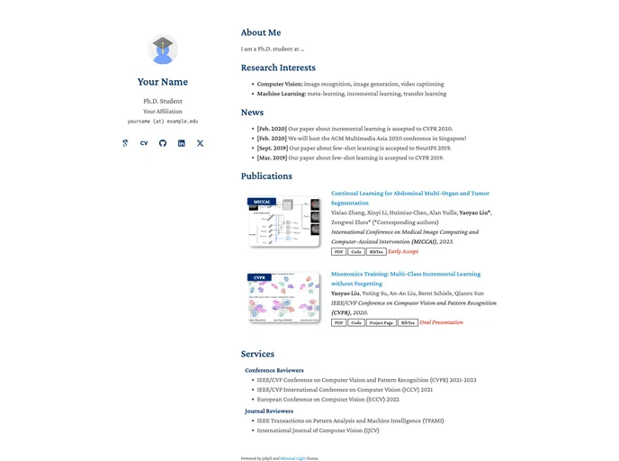
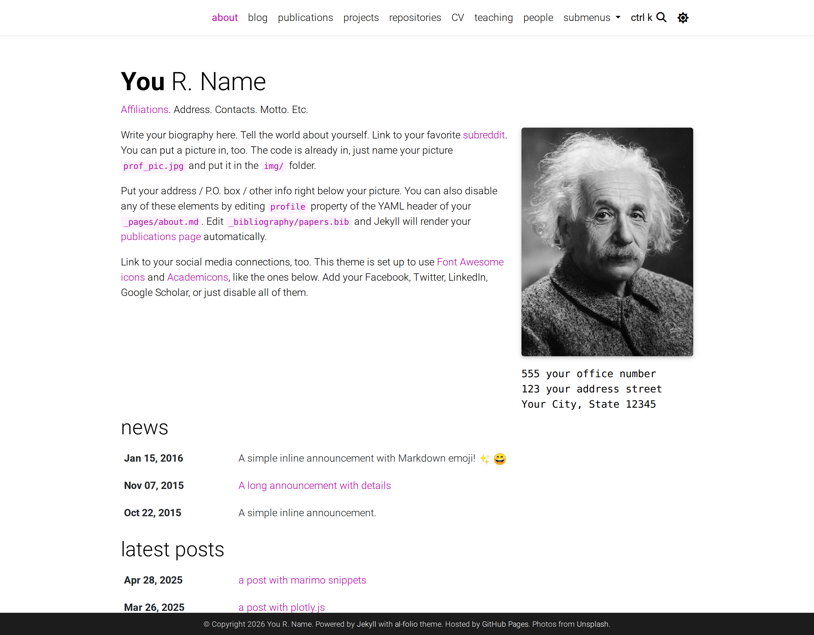
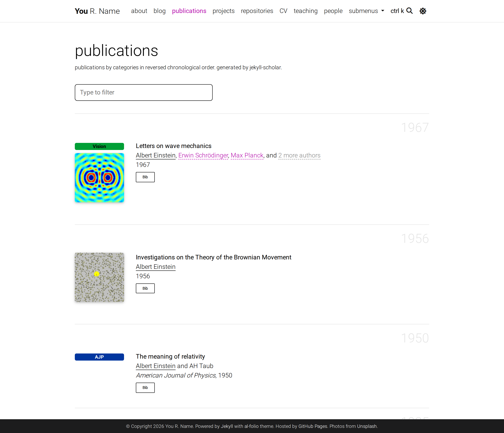

# 学术个人主页：新候选、计划与待办

更新日期：2026-09-15
当前状态：用户已选择 **A · Minimal Light**，已按用户简历更新学术资料，当前含 12 条经公开记录核验的论文；Scholar 完整列表核对待解除访问限流。预览地址为 `http://localhost:8000/`。首轮 Astro Resume、DevPortfolio、AstroPaper 均已淘汰。

实施记录、内容来源假设与验证结果见 [迁移记录](migration-notes.md)。用户已验收并授权提交、推送至 GitHub；头像和邮箱沿用此前说明的暂定旧站来源，自动化浏览器视觉验收尚未完成。

## 本轮方向

用户要求简洁、美观、偏重学术论文，并参考旧学术主页。新站以个人简介、研究方向和 Publications 为核心，保留论文与相关资料的入口。选择模板后再进行正式内容迁移。

设计侧重：白底、清晰字体、克制的强调色，首屏能看到简介和研究内容。论文标题、作者、会议或期刊、年份及 PDF/Slides/BibTeX 入口构成论文条目的主体。

## 旧站参考与资料状态

已检索到 [Yipei Niu 的旧学术主页](https://newypei.github.io/)，其姓名与研究主题同当前项目相符。用户选择模板后，已说明暂将该站作为本地迁移稿的来源；网址归属尚未收到明确回复，作为用户校对项保留。最新一轮已根据用户提供的简历与指定 Scholar 档案开展更新；受 Scholar 限流影响，新增论文先按出版社、arXiv 和 DBLP 核实，网站未发布。

| 页面 | 本次读到的内容 | 后续处理 |
| --- | --- | --- |
| [Home](https://newypei.github.io/) | 头像、简介、院校、导师、邮箱与原办公信息 | 保留资料来源；历史身份和联系方式需与当前情况核对 |
| [Research](https://newypei.github.io/research.html) | 8 篇论文：3 篇期刊、5 篇会议；Paper/Slides/Video 链接；Tricircle 项目 | 作为论文迁移清单基础，逐项保留作者顺序与文献类型 |
| [Biography](https://newypei.github.io/bio.html) | 简历介绍和 CV 链接 | 已提取历史资料；最新简历只提取学术字段，旧 CV 下载已移除 |
| [Awards](https://newypei.github.io/awards.html) | National Scholarship、Zhixing Scholarship，原文均为 2016–2017 | 两项历史奖学金已迁移，并按新简历补齐学术奖项与等级 |

旧站页面标注 2021 年生成，并仍写 Ph.D. student；不能直接作为现职介绍。Research 中的部分论文出版信息也可能已经更新，迁移时以原文为起点，与论文出版方、DOI 或作者认可的学术档案核对。

当前页面沿用 LLM Training、Distributed Systems、Reinforcement Learning、Multi-Agent Systems 研究兴趣，并结合论文补充 Serverless Computing 与 Cloud Resource Management。遵照用户要求，主页不显示公司、职位或任职经历。

## 新候选

以下为选型时保留的公开展示图，包含示例人物和论文。A 图片来自主题目录，B/C 来自官方仓库；均不是迁移后的页面。用户已选定 A，B/C 不再作为实施方案。迁移后的效果请看本地预览。

### A — Minimal Light（首推）

- [官方演示](https://minimal-light-theme.yliu.me/) · [源码](https://github.com/yaoyao-liu/minimal-light) · [CC0-1.0 许可证](https://github.com/yaoyao-liu/minimal-light/blob/main/LICENSE)
- 布局：左侧头像与联系方式，右侧简介、研究方向、论文列表；白底和深蓝标题，内容紧凑。
- 论文：支持标题、作者、会议/期刊信息、缩略图，以及 PDF、Code、BibTeX 等链接；条目在 `_data/publications.yml` 中维护。
- 对旧站的适配：将简介、研究与论文集中在一个页面，保留期刊/会议区别；仅为有合适原图的论文使用缩略图，其余可调整为纯文字条目。
- 维护：相对轻量，官方支持 GitHub Pages/Jekyll，并提供已编译的 HTML 版本。
- 推荐原因：学术内容直接出现在主页，又能保持简洁。适合当前找到的旧站资料规模。
- [截图来源页面](https://www.bestjekyllthemes.com/theme/yaoyao-liu-minimal-light/) · [截图原文件](https://deifkwefumgah.cloudfront.net/screenshots/thumbnail/yaoyao-liu-minimal-light-thumbnail-2x.webp)

### B — al-folio（论文管理更完整）

- [首页演示](https://alshedivat.github.io/al-folio/) · [论文页演示](https://alshedivat.github.io/al-folio/publications/) · [源码](https://github.com/alshedivat/al-folio) · [MIT 许可证](https://github.com/alshedivat/al-folio/blob/main/LICENSE)
- 布局：顶部导航、宽松的正文，简介旁放头像，首页可以显示代表论文，独立论文页列出全部发表。
- 论文：由 `_bibliography/papers.bib` 的 BibTeX 文献数据生成，支持年份分组、过滤、摘要及引用信息。
- 对旧站的适配：保留 About/Publications/CV 等必要入口，减少示例导航；将旧论文整理为结构化文献条目，原有 slides 等链接随条目保留。
- 维护：配置和依赖比 A 多，采用 Jekyll 与 GitHub Actions 构建；适合希望长期扩充论文库的人。
- 配色可以调整，示例中的洋红色不影响论文管理功能。
- 官方图片：[首页](https://raw.githubusercontent.com/alshedivat/al-folio/main/readme_preview/light.png) · [论文页](https://raw.githubusercontent.com/alshedivat/al-folio/main/readme_preview/publications.png)

### C — Academic Pages（传统多页学术结构）

- [首页演示](https://academicpages.github.io/) · [论文页演示](https://academicpages.github.io/publications/) · [源码与 MIT 许可证](https://github.com/academicpages/academicpages.github.io)
- 布局：左侧个人资料、顶部栏目导航，Research/Publications、Biography/CV 等内容可分别呈现。
- 论文：文字列表、Journal/Conference 分区、独立详情页，支持 Paper、Slides、BibTeX 下载入口。
- 对旧站的适配：最接近原先 Home/Research/Biography/Awards 的内容组织；论文没有缩略图时也自然。
- 维护：Markdown 管理内容，使用 Jekyll/GitHub Pages；有多个栏目，配置量高于单页方案。按已有内容裁剪示例栏目。
- 官方只有本次找到的首页截图，论文排版请看上面的论文页演示。
- [官方截图](https://raw.githubusercontent.com/academicpages/academicpages.github.io/master/images/themes/homepage-light.png)

### 怎么选

| 更看重什么 | 建议 |
| --- | --- |
| 简洁、学术内容集中在一页、视觉克制 | A · Minimal Light |
| 持续发表论文、用 BibTeX 管理文献 | B · al-folio |
| 保留旧站多页栏目、以文字论文列表为主 | C · Academic Pages |

综合当前偏好首推 A，B 次之。C 适合更看重旧站栏目延续性的人。

## 迁移后的内容安排

沿用英文与所选学术模板，以用户提供的简历更新教育和奖项，以可核实的学术记录更新论文。公司与职位不作为主页内容。

1. **个人简介**：姓名、头像、博士学位、简短研究介绍与学术联系入口。
2. **研究方向**：呈现当前项目中的研究兴趣；历史方向放入相应经历或研究简介。
3. **Publications**：核心栏目；按预印本/期刊/会议分组后年份倒序排列，突出本人作者名，保留论文、幻灯片、代码与引用入口中实际存在的项目。
4. **教育**：按简历列出博士、硕士和本科的专业与起止时间；不提供完整简历下载。
5. **项目与奖项**：只保留旧站或用户提供的真实内容，作为学术信息的补充。

论文条目需记录：标题、完整作者列表、本人位置、期刊/会议、年份、正式发表/预印本状态、卷期页码（如有）、DOI、PDF、Slides、Code、BibTeX、图片及原始来源。期刊扩展版和会议版分别保留，不能因标题相近误删。

论文全文入口使用对应出版方的官方地址，仅删除本地论文全文 PDF。全部 4 份原始 Slides PDF 保留在本地：USENIX 条目的 Slides 按钮继续指向官网，INFOCOM 2015、2017、2018 的 Slides 按钮使用原本地文件。每篇有幻灯片的论文通过 `local_slides` 记录存档路径，该字段不参与生成；页面按钮仍由 `links` 配置。

## 待办事项

### 1. 学术选型

- [x] 将方向调整为以论文和研究为核心。
- [x] 检索并阅读旧站候选的 Home、Research、Biography 页面。
- [x] 重新核验 3 款学术模板的演示、源码、许可证和论文功能。
- [x] 下载并查看模板预览图，记录出处。
- [ ] 用户确认旧站地址是否为 `https://newypei.github.io/`。
- [x] 用户选定 A · Minimal Light。

### 2. 内容整理（选定后）

- [x] 保存暂定旧站的四份源页面并建立迁移清单；论文全文改用官方链接并删除其本地 PDF，全部 4 份原始 Slides PDF 保留。
- [x] 提取论文、图片和开源项目资料，并按用户简历补充教育及奖项。
- [x] 核对作者顺序、出版信息、文献类型和所有论文附件链接。
- [x] 按简历确认 2023 年 6 月博士毕业，移除公司、职位与任职相关表述。
- [ ] 用户校对沿用的头像、邮箱。
- [ ] 取得 Scholar 完整列表后确认论文无遗漏；当前 12 条由 DBLP、出版社与 arXiv 核验。
- [x] 将论文整理为 JSON 数据，生成 BibTeX 和静态 HTML。

### 3. 实施与验证

- [x] 接入所选模板并记录版本，保留模板及字体许可证。
- [x] 按暂定旧站来源填充资料，移除模板示例人物、论文和统计代码。
- [x] 调整论文排版、本人姓名强调、期刊/会议分组和资源链接。
- [x] 提供可浏览的本地预览，HTTP 访问正常。
- [ ] 完成桌面和手机端的实际视觉检查；Browser 当前不可用。
- [x] 保留八篇历史论文记录，新增四条有出版记录支持的论文；预印本单独分组，引用记录独立复核。
- [x] 按用户补充加入两项荣誉，论文全文入口替换为官方地址，仅删除本地论文全文 PDF。
- [x] 恢复全部 4 份原始 Slides PDF；保留 USENIX 官方 Slides 按钮，恢复 3 篇 INFOCOM 的本地 Slides 按钮，并以 `local_slides` 记录各份存档。
- [x] 静态构建及内部链接检查通过，补充 GitHub Pages 发布说明和日常更新文档。
- [x] 用户已验收预览并授权提交、推送仓库。
- [ ] 核实 GitHub Pages 线上部署结果。

当前页面已完成迭代，用户已验收并授权提交、推送至 `origin/main`。

恢复幻灯片后的静态检查已通过：12 篇论文、12 处 BibTeX、9 个本地资源引用；相较此前增加的 3 个本地引用来自 INFOCOM Slides 按钮。4 份本地 Slides 均已通过原始文件 SHA-256 核对与 HTTP 访问检查。
